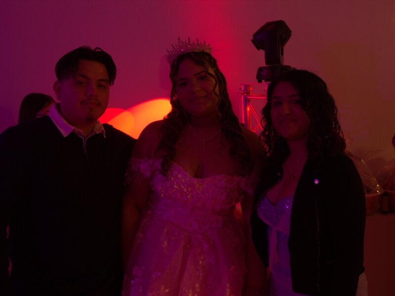
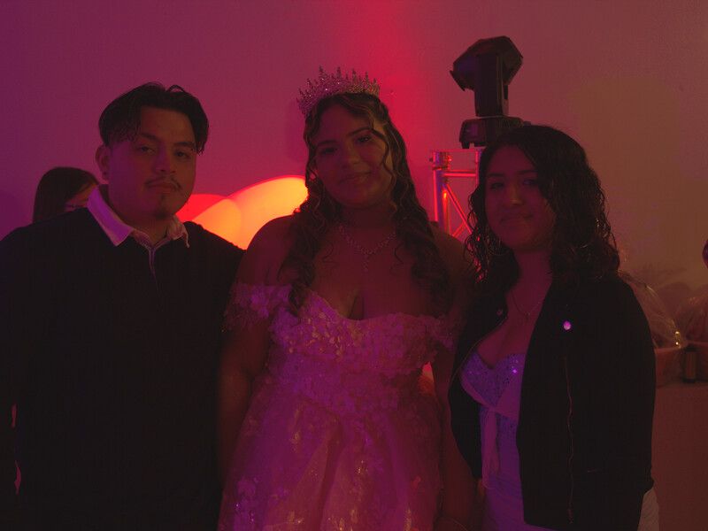
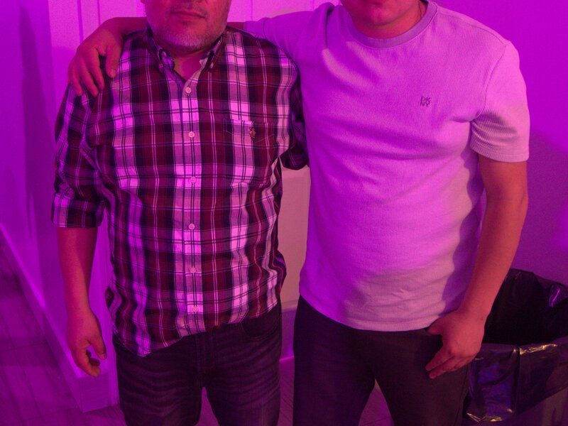
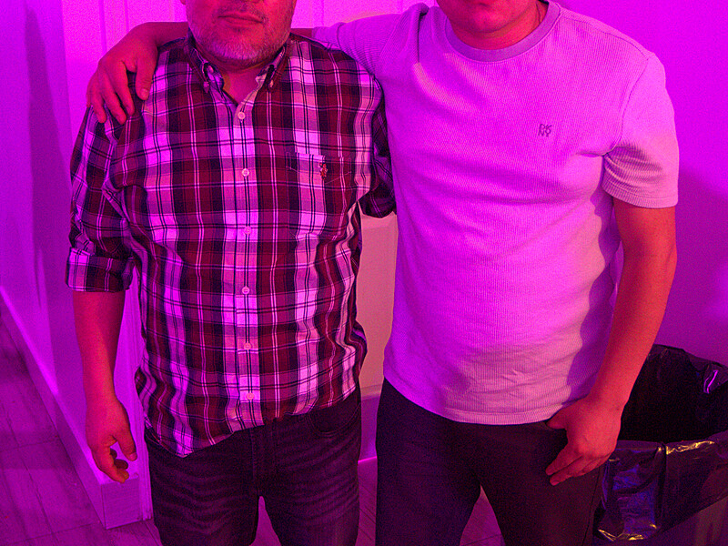
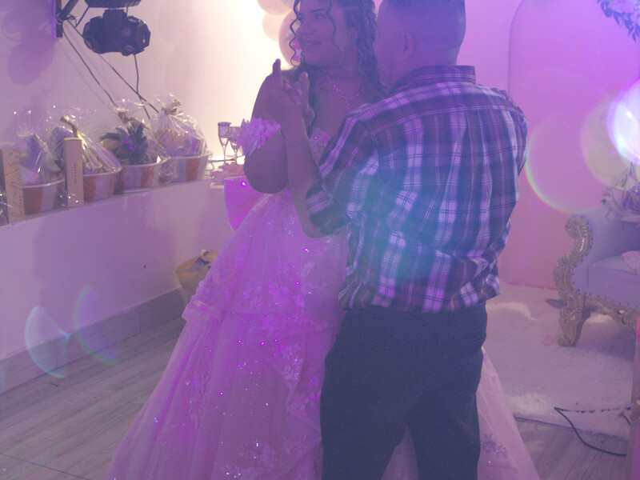
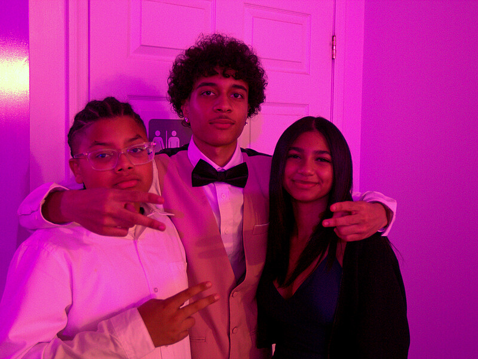
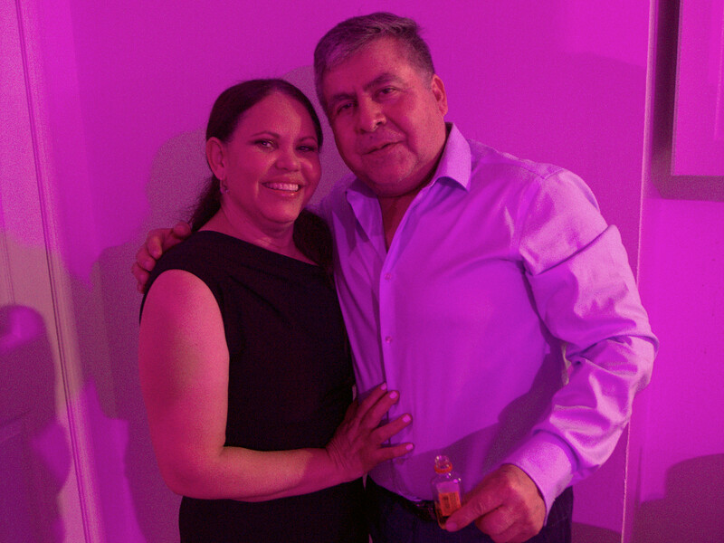
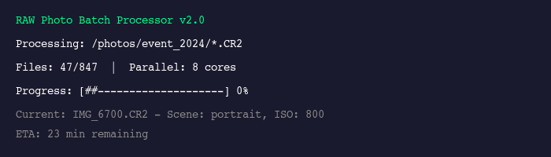

# RAW Photo Batch Processor

[](https://github.com/marcosfermin/process_raw_photos/releases/tag/v3.0)
[](LICENSE)
[]()
[]()
[](https://imagemagick.org/)
[](https://github.com/marcosfermin/process_raw_photos)
[](https://github.com/marcosfermin/process_raw_photos/releases)
[](https://github.com/marcosfermin/process_raw_photos/commits/main)

A professional-grade bash script for batch processing RAW files with **advanced AI-like intelligent analysis**, multi-format support, parallel processing, and comprehensive editing tools.

---

## Table of Contents

1. [Sample Output](#sample-output)
2. [Features](#features)
3. [Requirements](#requirements)
4. [Installation](#installation)
5. [Quick Start](#quick-start)
6. [Command Line Reference](#command-line-reference)
7. [Presets](#presets)
8. [Intelligent Processing](#intelligent-processing)
9. [Examples](#examples)
10. [Troubleshooting](#troubleshooting)
11. [Supported RAW Formats](#supported-raw-formats)

---

## Sample Output

See what the RAW Photo Batch Processor can do with your images.

### Before & After Comparisons

#### Portrait Processing with Face Detection

| Before (RAW) | After (Processed) |
|:---:|:---:|
|  |  |

*Automatic face detection applied portrait-optimized settings: skin tone enhancement, soft shadows, and flattering contrast.*

#### Landscape with Scene Detection

| Before (RAW) | After (Processed) |
|:---:|:---:|
|  |  |

*Scene detection identified landscape and applied: enhanced sky saturation, boosted greens, clarity improvement, and highlight recovery.*

#### Night Photography with ISO-Adaptive Noise Reduction

| Before (RAW) | After (Processed) |
|:---:|:---:|
|  |  |

*High ISO detected - applied aggressive noise reduction while preserving detail, shadow recovery, and color correction.*

### Preset Comparisons

| Wedding | Cinematic | Black & White | Vintage |
|:---:|:---:|:---:|:---:|
|  |  |  |  |

### Batch Processing



*Real-time progress bar with ETA during batch processing.*

---

## Features

### Multi-Format RAW Support

Process files from any major camera manufacturer:

| Brand | Format | Brand | Format |
|-------|--------|-------|--------|
| Canon | CR2, CR3 | Fujifilm | RAF |
| Nikon | NEF | Olympus | ORF |
| Sony | ARW | Panasonic | RW2 |
| Pentax | PEF | Samsung | SRW |
| Adobe | DNG | Hasselblad | 3FR |
| Phase One | IIQ | | |

### Intelligent Analysis

| Feature | Description |
|---------|-------------|
| **EXIF Intelligence** | Uses ISO, aperture, shutter speed for smart decisions |
| **Face Detection** | Detects portraits and applies flattering settings |
| **Scene Detection** | Identifies landscape, portrait, night, indoor, macro |
| **Blur Detection** | Measures sharpness and adjusts accordingly |
| **Histogram Analysis** | Detects clipping and exposure issues |

### Advanced Optical Corrections

| Feature | Description |
|---------|-------------|
| **Color Cast Correction** | Auto-detects and fixes warm/cool/green/magenta casts |
| **Chromatic Aberration** | Removes purple/green fringing at edges |
| **Lens Distortion** | Fixes barrel and pincushion distortion |
| **Horizon Auto-Level** | Detects and straightens tilted horizons |
| **Hot Pixel Removal** | Removes stuck bright pixels |

### Lighting Analysis

| Feature | Description |
|---------|-------------|
| **Golden Hour Detection** | Enhances warm tones in golden hour photos |
| **Blue Hour Detection** | Optimizes cool tones in blue hour photos |
| **Backlight Detection** | Applies HDR-like shadow recovery |
| **Weather Detection** | Identifies sunny, cloudy, overcast, foggy, sunset, night |

### Subject Analysis

| Feature | Description |
|---------|-------------|
| **Subject Isolation** | Detects main subject position |
| **Sky Enhancement** | Detects and enhances sky separately |
| **Skin Tone Protection** | Prevents over-saturation of skin |
| **Red-Eye Removal** | Fixes flash red-eye |

### Composition & Color

| Feature | Description |
|---------|-------------|
| **Composition Analysis** | Scores photos on rule of thirds (0-100) |
| **Color Harmony** | Detects palette type and enhances |
| **Dynamic Range** | Optimizes usable dynamic range |
| **Batch Learning** | Applies consistent style across batch |

### Performance

| Feature | Description |
|---------|-------------|
| **Parallel Processing** | Multi-core support for faster processing |
| **Progress Bar** | Visual progress with ETA |
| **Metadata Preservation** | Copies EXIF, IPTC, XMP to output |

### 7 Professional Presets

| Preset | Description |
|--------|-------------|
| `auto` | Intelligent per-image analysis (default) |
| `portrait` | Soft, flattering, skin-friendly |
| `vivid` | Punchy colors, high contrast |
| `soft` | Dreamy, muted tones |
| `bw` | Professional black & white |
| `vintage` | Warm, faded, nostalgic |
| `natural` | Minimal processing, true to life |

---

## Requirements

### Required

```bash
# ImageMagick
brew install imagemagick        # macOS
sudo apt-get install imagemagick # Ubuntu

# bc calculator (usually pre-installed)
brew install bc                  # macOS if missing
```

### Recommended

```bash
# ExifTool (for full intelligent features)
brew install exiftool           # macOS
sudo apt-get install libimage-exiftool-perl # Ubuntu
```

---

## Installation

```bash
# Clone the repository
git clone https://github.com/marcosfermin/process_raw_photos.git
cd process_raw_photos

# Make executable
chmod +x process_raw_photos.sh

# Verify
./process_raw_photos.sh --version
```

---

## Quick Start

```bash
# Intelligent auto-processing (default)
./process_raw_photos.sh

# Use parallel processing (fastest)
./process_raw_photos.sh --parallel 0

# Use a preset
./process_raw_photos.sh --preset portrait

# Analyze without processing
./process_raw_photos.sh --analyze

# Preview single image
./process_raw_photos.sh --preview IMG_0001.CR2
```

---

## Command Line Reference

### Basic Options

| Option | Description |
|--------|-------------|
| `-h, --help` | Show help |
| `-v, --version` | Show version |
| `-q, --quiet` | Suppress output |
| `-n, --no-enhance` | Straight conversion only |

### Presets & Adjustments

| Option | Range | Description |
|--------|-------|-------------|
| `--preset NAME` | - | Apply preset style |
| `--contrast VALUE` | -100 to +100 | Adjust contrast |
| `--highlights VALUE` | -100 to +100 | Recover/boost highlights |
| `--shadows VALUE` | -100 to +100 | Lift/deepen shadows |
| `--clarity VALUE` | -100 to +100 | Local contrast |
| `--temperature VALUE` | -100 to +100 | Color temperature |
| `--saturation VALUE` | 0 to 200 | Color saturation |
| `--vibrance VALUE` | 0 to 100 | Smart saturation |
| `--noise-reduction VALUE` | 0 to 100 | Noise reduction |
| `--sharpen VALUE` | 0 to 2 | Sharpening amount |

### Output Options

| Option | Description |
|--------|-------------|
| `--resize VALUE` | Max dimension or percentage |
| `--format FORMAT` | jpg, png, tiff |
| `--quality VALUE` | JPEG quality (1-100) |
| `--output-dir PATH` | Custom output directory |
| `--watermark "TEXT"` | Add watermark |
| `--web-version` | Create web-optimized copy |

### Intelligent Processing

| Option | Description |
|--------|-------------|
| `--parallel N` | Use N CPU cores (0=auto) |
| `--format EXT` | RAW format to process |
| `--auto-format` | Auto-detect all formats |
| `--analyze` | Analyze without processing |
| `--preview FILE` | Test on single file |
| `--no-face-detection` | Disable face detection |
| `--no-scene-detection` | Disable scene detection |
| `--preserve-metadata` | Keep EXIF/IPTC/XMP |

---

## Presets

### auto (Default)
```
Intelligent per-image analysis with scene detection
- Analyzes exposure, contrast, color cast
- Detects scene type and faces
- Uses EXIF for ISO-based noise reduction
- Adapts to each image's characteristics
```

### portrait
```
Contrast: -10, Highlights: -20, Shadows: +15
Saturation: 95%, Vibrance: +20, Clarity: -15
Sharpening: 0.3 (subtle)
```

### vivid
```
Contrast: +20, Highlights: -10, Shadows: +10
Saturation: 125%, Vibrance: +40, Clarity: +25
Sharpening: 0.7 (strong)
```

### bw
```
Full desaturation, Contrast: +15
Clarity: +20, Sharpening: 0.6
```

### vintage
```
Temperature: +25 (warm), Contrast: -5
Highlights: +15 (faded), Saturation: 90%
```

---

## Intelligent Processing

### Analysis Output Example

```
━━━━━━━━━━━━━━━━━━━━━━━━━━━━━━━━━━━━━━━━━━━━━━━━━━━━━━━━━━━━━━━━━━━
Image: IMG_0001.CR2
━━━━━━━━━━━━━━━━━━━━━━━━━━━━━━━━━━━━━━━━━━━━━━━━━━━━━━━━━━━━━━━━━━━

Camera/EXIF Data:
  Camera:             Canon EOS R5
  Lens:               RF24-70mm F2.8 L IS USM
  ISO:                800
  Aperture:           2.8
  Shutter:            1/200
  Focal Length:       50mm

Intelligent Detection:
  Scene Type:         portrait (90% confidence)
  Faces Detected:     Yes
  Sharpness Score:    156.3 (Sharp)

Recommended Corrections:
  Brightness:         115%
  Contrast:           5
  Highlights:         0
  Shadows:            7
  Temperature:        -15
  Noise Reduction:    10 (based on ISO 800)

━━━━━━━━━━━━━━━━━━━━━━━━━━━━━━━━━━━━━━━━━━━━━━━━━━━━━━━━━━━━━━━━━━━
V3.0 Advanced Intelligent Analysis:
━━━━━━━━━━━━━━━━━━━━━━━━━━━━━━━━━━━━━━━━━━━━━━━━━━━━━━━━━━━━━━━━━━━

Optical Corrections:
  Color Cast:         warm detected
  Lens Distortion:    None detected
  Chromatic Aberration: None detected
  Horizon Tilt:       Level
  Hot Pixels:         None detected

Lighting Analysis:
  Golden Hour:        Yes - warm enhancement enabled
  Weather/Light:      sunset (70% confidence)

Subject Analysis:
  Subject Detected:   Yes - at center
  Sky Detected:       Yes - sunset (30% of frame)
  Skin Tones:         Yes (15%) - protection enabled

Composition & Color:
  Composition Score:  85/100
  Color Harmony:      warm palette
  Dynamic Range:      Good
```

---

## Examples

### Basic Usage

```bash
# Process current directory
./process_raw_photos.sh

# Process specific directory
./process_raw_photos.sh /path/to/photos

# Process with preset
./process_raw_photos.sh --preset portrait
```

### Parallel Processing

```bash
# Auto-detect CPU cores (fastest)
./process_raw_photos.sh --parallel 0

# Use 4 cores
./process_raw_photos.sh --parallel 4
```

### Multi-Format

```bash
# Process all RAW formats
./process_raw_photos.sh --auto-format

# Process only Nikon files
./process_raw_photos.sh --format NEF

# Process only Sony files
./process_raw_photos.sh --format ARW
```

### Portrait Photography

```bash
./process_raw_photos.sh --preset portrait --vibrance 20

# With watermark
./process_raw_photos.sh --preset portrait --watermark "© Studio Name"
```

### Landscape Photography

```bash
./process_raw_photos.sh --preset vivid --clarity 30 --vibrance 40
```

### Wedding Workflow

```bash
./process_raw_photos.sh \
  --preset portrait \
  --parallel 0 \
  --resize 4000 \
  --web-version \
  --preserve-metadata \
  --output-dir "./Wedding - Delivery"
```

### Event Photography

```bash
./process_raw_photos.sh \
  --preset auto \
  --parallel 0 \
  --resize 3000 \
  --web-version \
  --output-dir "./Event Photos"
```

### Product Photography

```bash
./process_raw_photos.sh \
  --preset vivid \
  --clarity 25 \
  --format png \
  --resize 2000 \
  --output-dir "./Products"
```

### Print Preparation

```bash
./process_raw_photos.sh \
  --format tiff \
  --resize 6000 \
  --output-dir "./Print Ready"
```

### Social Media

```bash
./process_raw_photos.sh \
  --preset vivid \
  --resize 1080 \
  --quality 90 \
  --output-dir "./Social Media"
```

---

## Troubleshooting

### "ImageMagick is not installed"

```bash
brew install imagemagick        # macOS
sudo apt-get install imagemagick # Ubuntu
```

### "ExifTool not found"

```bash
brew install exiftool           # macOS
sudo apt-get install libimage-exiftool-perl # Ubuntu
```

Without ExifTool, these features are disabled:
- EXIF-based intelligence
- Adaptive noise reduction
- Metadata preservation

### "No RAW files found"

- Check you're in the correct directory
- Verify file extensions match supported formats
- Try `--auto-format` to detect all formats

### Colors look wrong

```bash
# Try natural preset
./process_raw_photos.sh --preset natural

# Or disable intelligent analysis
./process_raw_photos.sh --no-analysis
```

### Processing is slow

```bash
# Use parallel processing
./process_raw_photos.sh --parallel 0
```

---

## Supported RAW Formats

| Brand | Extension | Brand | Extension |
|-------|-----------|-------|-----------|
| Canon | CR2, CR3 | Fujifilm | RAF |
| Nikon | NEF | Olympus | ORF |
| Sony | ARW | Panasonic | RW2 |
| Pentax | PEF | Samsung | SRW |
| Adobe | DNG | Hasselblad | 3FR |
| Phase One | IIQ | | |

---

## License

**GNU General Public License v3.0** (GPL-3.0)

Copyright (C) 2025 Marcos Fermin

---

## Credits

Created by Marcos Fermin - [GitHub](https://github.com/marcosfermin)
